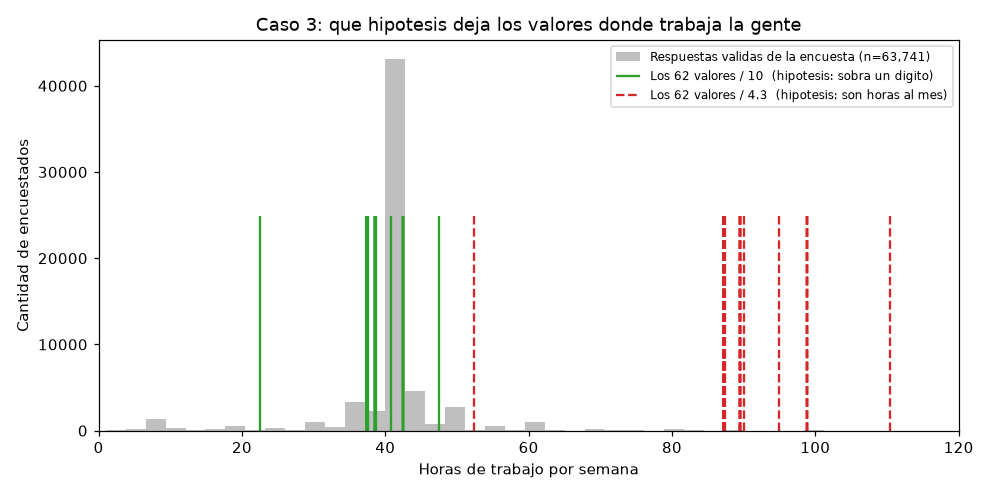

# Evidencia para los párrafos de Daniel

Material de trabajo para redactar **D5, D6 y E3**. Todos los números salen de correr
`limpieza_stackoverflow.py`; las secciones citadas dicen de dónde.

> **Acá no hay ni una línea de argumento, y es a propósito.** El parcial prohíbe que la
> IA redacte las justificaciones, y **P34** pregunta textual qué le pidieron a la
> herramienta y qué cambiaron ustedes. Los datos son datos: el razonamiento que los
> conecta con la decisión lo escribe Daniel.

## Cómo se arma cada párrafo

Cuatro movimientos, en este orden:

| | Movimiento | Estado |
|---|---|---|
| 1 | **La decisión** — qué se hizo, una frase seca | ✅ está abajo |
| 2 | **La evidencia** — el número que sale del script | ✅ está abajo |
| 3 | **El puente** — por qué ese número sostiene la decisión | ⬜ lo escribe Daniel |
| 4 | **El límite** — qué la haría falsa, o qué se asumió sin poder probar | ⬜ lo escribe Daniel |

El movimiento 3 es el que califican. El 4 es el que separa un párrafo de 5 de uno de 3:
casi nadie lo escribe, y es el que demuestra que entendieron en vez de haber acertado.

---

# D5 · Por qué `WorkWeekHrs` se divide entre 10

**Responde a:** P4 — *¿Cuál de sus decisiones de limpieza es la más discutible?
Defiéndala.*
**Dónde está en el código:** §8, caso 3.

### La decisión

62 registros con `WorkWeekHrs` por encima de 168 se corrigieron dividiendo entre 10, en
vez de eliminarlos o tratarlos como faltantes. Una semana tiene 168 horas (24 × 7), así
que cualquier valor por encima es físicamente imposible.

### El mecanismo real: no sobraba un dígito, se perdió la coma

La primera lectura es "a la persona se le fue un dígito". Los datos dicen algo más
preciso, y más fácil de defender.

**De dónde son los 62:**

| País | % entre los 62 | % en el dataset |
|---|---|---|
| **Noruega** | **22,6%** | 0,6% |
| **Finlandia** | **19,4%** | 0,5% |
| Alemania | 12,9% | 6,1% |
| **Austria** | **9,7%** | 0,8% |
| Francia | 8,1% | 3,0% |

Noruega aparece 37 veces más de lo que le correspondería; Finlandia, 39 veces más. Si
fuera azar de tipeo, los países se repartirían como en el resto de la encuesta.

**La jornada estándar en Noruega y Finlandia es de 37,5 horas, y esos países escriben el
decimal con coma.** El `375` que aparece 44 veces es `37,5` al que el formulario le comió
el separador.

Eso cambia la naturaleza de la corrección: dividir entre 10 no inventa un número,
**reconstruye un separador perdido en la captura**.

### La hipótesis rival que hay que derribar

Queda otra lectura posible: **que la persona respondió horas al MES** en vez de a la
semana. Si fuera así habría que dividir entre 4,3 (semanas por mes), no entre 10.

Las dos se miden contra la misma pregunta: *¿cuál deja los valores donde trabaja la gente
de verdad?*

### Los 62 valores, uno por uno

| Valor original | Casos | ÷ 10 | ÷ 4,3 (mes) |
|---|---|---|---|
| 225 | 1 | 22,5 | 52,3 |
| **375** | **44** | **37,5** | 87,2 |
| 376 | 1 | 37,6 | 87,4 |
| 385 | 8 | 38,5 | 89,5 |
| 387 | 1 | 38,7 | 90,0 |
| 408 | 1 | 40,8 | 94,9 |
| 425 | 5 | 42,5 | 98,8 |
| 475 | 1 | 47,5 | 110,5 |
| | **62** | **22,5 – 47,5** | **52,3 – 110,5** |

### El contraste

| | ÷ 10 (coma decimal perdida) | ÷ 4,3 (horas al mes) |
|---|---|---|
| Rango resultante | 22,5 – 47,5 h/semana | 52,3 – 110,5 h/semana |
| **Por encima de 60 h/semana** | **0 de 62** | **61 de 62** |

### Tres datos más que suman

- **44 de los 62 valores son exactamente `375`.** Si fueran 62 personas reportando
  realidades distintas, no tendrían por qué coincidir.
- **No son consultores.** Independientes (freelance o cuenta propia): **1,6% entre los 62
  contra 8,8% en el dataset**. Son empleados, no gente facturando por hora.
- **Sueldo mediano de los 44 que escribieron `375`: 55.718 USD**, contra 54.049 del resto
  de la encuesta. Gente absolutamente promedio.
- Los valores más frecuentes en el resto de la encuesta: **40 h** (19.292 respuestas),
  45 h (3.787), 50 h (2.747), 35 h (2.000), 38 h (1.352).

### La foto



Las líneas verdes son los 62 valores divididos entre 10: caen encima del pico de 40
horas. Las rojas punteadas son los mismos valores divididos entre 4,3: quedan entre 85 y
110 horas, donde casi no hay respuestas.

La regenera el script en `salidas/graficas/atipicos_WorkWeekHrs_hipotesis.png`.

### ⬜ Falta escribir

- **Movimiento 3:** ¿por qué el hecho de que los 62 caigan en jornadas creíbles al
  dividir entre 10 prueba que hubo un error de captura? ¿Qué se habría visto si la
  hipótesis fuera falsa? (Pista: dividir entre 10 es aritmética, no sabe nada de horas
  de trabajo. Podría haber dado 3 h o 90 h. Dio jornadas normales 62 veces de 62.)
- **Movimiento 4:** dividir entre 10 escribe un número que el encuestado no tecleó.
  ¿Por qué reconstruir una coma perdida no es lo mismo que inventar un dato? ¿Qué
  quedaría sin explicar si los países NO se concentraran como se concentran?

---

# D6 · Por qué `CompTotal` no se reconstruye

**Responde a:** P6 — *¿Qué información se perdió irreversiblemente en su proceso de
limpieza?*
**Dónde está en el código:** §8, caso 5.

### La decisión

28 registros con `CompTotal` por encima de 10⁹ se anularon (quedan como faltante). No se
imputan y no se intenta reconstruir el valor real cruzando `CompFreq` con la moneda.

### Los 6 valores más extremos

| CompTotal | Moneda | CompFreq | ConvertedComp |
|---|---|---|---|
| 1,111 × 10²⁴⁷ | BYN | Weekly | 1.000.000 |
| 1 × 10¹⁵⁰ | USD | Weekly | 2.000.000 |
| 1 × 10⁵⁶ | USD | Yearly | 2.000.000 |
| 1 × 10⁴⁹ | CAD | Yearly | 1.000.000 |
| 1 × 10³⁶ | INR | Weekly | 1.000.000 |
| 8,99 × 10³⁰ | EUR | Weekly | 1.000.000 |

### Los números

- **141 monedas distintas** en el dataset (columna `CurrencySymbol`).
  ⚠️ **Es 141, no 142.** El script contaba `"Desconocido"` —el relleno que §4.5 pone
  donde nadie respondió— como si fuera una moneda. Ya está corregido, pero si alguien
  anotó 142 en algún lado, hay que cambiarlo.
- `CompFreq` solo tiene tres valores: `Monthly`, `Yearly`, `Weekly`.
- **De los 28 registros absurdos, 26 tienen `ConvertedComp` válido.** La encuesta ya
  resolvió el sueldo de esas personas en USD.
- El valor máximo del dataset, 1,111 × 10²⁴⁷, es más grande que el número de átomos del
  universo observable.

### ⬜ Falta escribir

- **Movimiento 3:** ¿por qué el hecho de que la encuesta ya entregue `ConvertedComp` en
  USD hace innecesario reconstruir `CompTotal`?
- **Movimiento 4:** se anula un valor sin intentar recuperarlo. ¿Qué información se
  pierde ahí, y por qué esa pérdida es aceptable?

---

# E3 · Los siete casos de atípicos

**Responde a:** P16 — *¿Qué atípico conservaron y por qué?*
**Dónde está en el código:** §8, casos 1 a 7.

### El método declarado

Rango intercuartílico con **factor 1,5**. Todo valor fuera de
`[Q1 − 1,5·RIC, Q3 + 1,5·RIC]` queda marcado como candidato.

**Detalle importante:** los límites se calculan sobre los datos **sin imputar**. Con la
columna ya imputada, el relleno masivo con la mediana amontona miles de valores en el
centro y aprieta Q1 y Q3: `WorkWeekHrs` llegaba a dar límites [40, 40].

### Los siete casos

| Caso | Qué marca el RIC | Registros | Clasificación | Acción |
|---|---|---|---|---|
| 1 | `Age > 100` | 1 | Error de digitación | Reemplazar por mediana (29) |
| 2 | `Age < 10` | 9 | Observación contaminante | Reemplazar por mediana (29) |
| 3 | `WorkWeekHrs > 168` | 62 | Error de unidad o escala | Dividir entre 10 |
| **4** | `WorkWeekHrs` 100–168 | 154 | Observación válida extrema | **CONSERVAR** ← el obligatorio |
| 5 | `CompTotal > 10⁹` | 28 | Error de digitación | Anular el valor |
| 6 | `ConvertedComp > 200.528` | 2.301 | **Subpoblación distinta** | Conservar y marcar |
| 7a | `YearsCode` / `YearsCodePro` imposibles | 47 + 4 | Error de digitación | Reemplazar por mediana |
| 7b | `YearsCode` / `YearsCodePro` veteranos | 3.072 + 1.890 | Observación válida extrema | CONSERVAR |

### Las cinco categorías del enunciado, todas usadas

| Categoría | Dónde |
|---|---|
| Error de digitación | casos 1, 5, 7a |
| Error de unidad o escala | caso 3 |
| Observación válida extrema | casos 4, 7b |
| Subpoblación distinta | caso 6 |
| Observación contaminante | caso 2 |

### El caso obligatorio (caso 4)

El enunciado exige mostrar **un atípico que el método marcó y que NO debe eliminarse**,
explicando por qué el método falló ahí.

154 registros con `WorkWeekHrs` entre 100 y 168 horas semanales. El RIC los marca porque
están lejos del resto. Pero 168 es el máximo físico de una semana: son valores posibles.

### La evidencia del caso 6 (subpoblación distinta)

Los 2.301 sueldos altos no están repartidos al azar:

| País | % entre salarios altos | % en todo el dataset |
|---|---|---|
| Estados Unidos | **48,6%** | 19,5% |
| Reino Unido | **14,1%** | 6,1% |
| Alemania | 4,8% | 6,1% |
| Canadá | 3,2% | 3,4% |
| Australia | 3,2% | 1,9% |
| India | 3,1% | **13,1%** |

Además: **91% con empleo de tiempo completo** contra 70% en el resto, y mediana de
**9 años** de experiencia profesional contra 6.

### El cierre obligatorio

Si se hubieran eliminado todas las filas marcadas como atípicas en cualquiera de las 6
variables revisadas: **14.653 filas de 63.803 = 23,0% del dataset**.

### ⬜ Falta escribir

- **Movimiento 3, siete veces:** por qué cada grupo cayó en esa categoría y no en otra.
  Es el párrafo más largo de los tres, por eso.
- **Movimiento 4:** el caso 4 es el que el enunciado exige. ¿Por qué falló el método
  estadístico ahí? ¿Qué no puede ver el RIC?

---

## Para verificar cualquier número

```bash
.venv/bin/python limpieza_stackoverflow.py
```

La huella del CSV tiene que dar
`d1ca48a07a446b9623a74542cc45006fac29ac3bfc285cefeaa64a1eb03a5e21`. Si da otra cosa, algo
cambió y los números de este documento ya no valen.

**Este archivo no va en la entrega.** Es material de trabajo.
